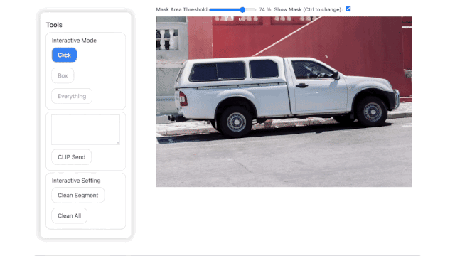

# Segment Anything web UI



This is a web interface for the [Segment Anything](https://github.com/facebookresearch/segment-anything).

## Usage

**Environment Require:**
Python >= 3.8.13, Node >= 18.15.0 (LTS), CUDA or MPS(optional)

1. Fowllow the instructions in the [Segment Anything](https://github.com/facebookresearch/segment-anything) and [CLIP](https://github.com/openai/CLIP) to install SAM and CLIP. And prepare webui environment:

```shell
# e.g. for Segment Anything
pip install git+https://github.com/facebookresearch/segment-anything.git
pip install opencv-python pycocotools matplotlib onnxruntime onnx

mkdir model
# download the model to `model/`
wget https://dl.fbaipublicfiles.com/segment_anything/sam_vit_b_01ec64.pth -O model/sam_vit_b_01ec64.pth
# https://dl.fbaipublicfiles.com/segment_anything/sam_vit_l_0b3195.pth
# https://dl.fbaipublicfiles.com/segment_anything/sam_vit_h_4b8939.pth

# e.g. for CLIP
pip install torch torchvision
pip install ftfy regex tqdm
pip install git+https://github.com/openai/CLIP.git

# python server as backend
pip3 install torch numpy 'uvicorn[standard]' fastapi pydantic python-multipart Pillow click
# or 
cd scripts && pip3 install -r requirements.txt
# webui frontend
npm i
```

2. run the server and webui on different terminals:

```bash
python3 scripts/server.py   # webui backend
npm run dev                 # interactive webui frontend
```

Or
```shell
docker compose up
```

## Advanced

Change the `.env.local` file to change the server address.

The model server can be run on a remote GUI server, and the webui can be run on a local machine.

The API in `server.py` is **Pure Function**. Though it is slow (Encoding Image Each Request), it is easy to deploy and maintain.

## Reference

- [Segment Anything | Meta AI](https://segment-anything.com/)
- [facebookresearch/segment-anything: The repository provides code for running inference with the SegmentAnything Model (SAM), links for downloading the trained model checkpoints, and example notebooks that show how to use the model.](https://github.com/facebookresearch/segment-anything)

## License
MIT
